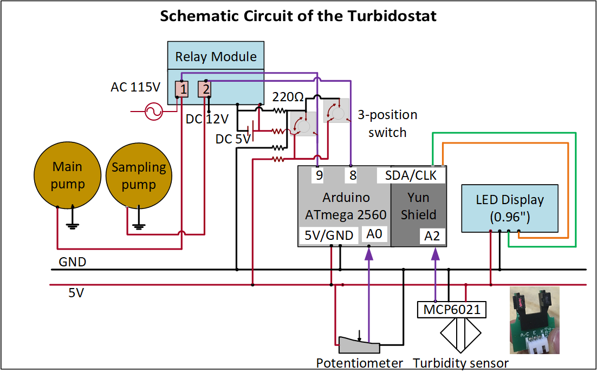
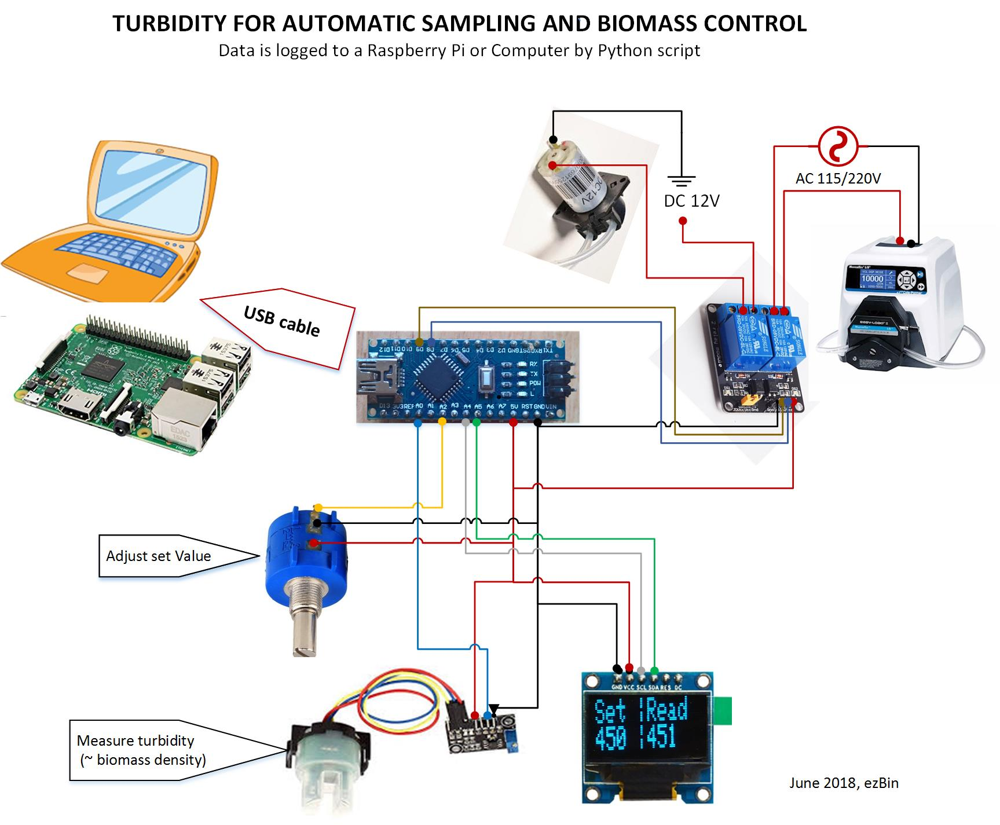
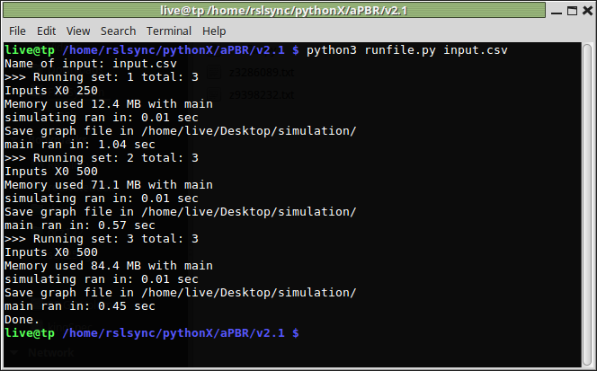
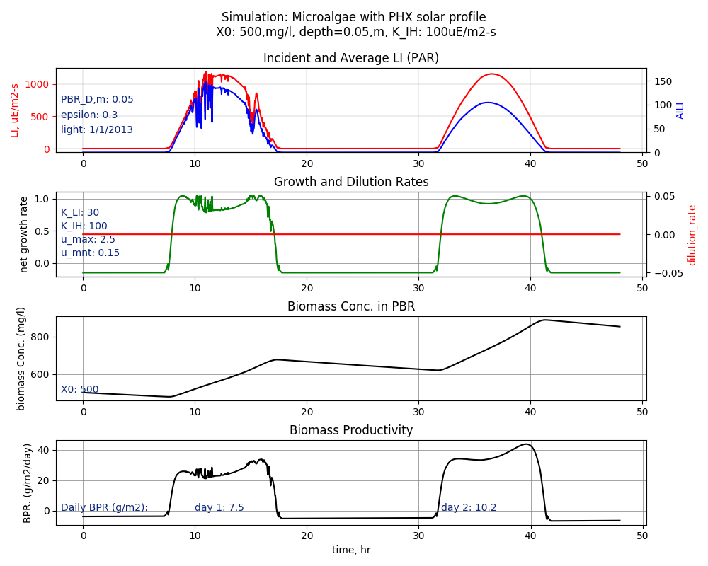

# Advanced-bioreactor
the components and codes were built for an algae cultivation vessel using inorganic carbon (CO2), and light energy (from LED or the Sun), but the principle works for other systems, e.g. indoor plantation, other microbial culvation systems.

## I. The following components are hosted here:

- high powered LED control that mimicking a pre-defined solar pattern for one day. <a href='https://www.instructables.com/id/Control-High-powered-LED-Panel-by-Arduino-Real-Tim/'>More details on instructables.com</a>
- data logger for pH, DO, and temperature, timestamp. <a href='https://www.instructables.com/id/How-to-Make-a-Data-Logger-for-the-Temperature-PH-a/'>More details here</a> 
- a turbidity monitoring and control using infra-red sensor, applied to measure and control algal biomass density. <a href='https://www.sciencedirect.com/science/article/pii/S2211926417307683'>Link to a journal publication on Sciencedirect.com </a>.  The 1st version dated 0726, and the cleanup version dated 2018.
- alternative approach: turbidity (biomass density) monitoring and control, data logged via USB cable to the laptop or Raspberry Pi by a Python script. No need YunShield as the above approach.
- simulation using Python3 for the algae growth in the _batch_ or _turbidity-stat_ mode.
## II. Schematic of each module:
### 1. LED Control and Lux Measurement

<p align="center">
  
</p>

### 2.  Data Logger
<p align="center">
  
</p>


### 3.  Turbidity monitoring and control
<p align="center">
  
</p>

### 4. Turbidity and logging data via USB cable
<p align="center">
  
</p>

### 5. Simulation of algae growing batch
#### Noted as v1.0 inside the //simulation// folder
Below are two-day simulation, running ~2880 steps in 0.01 secs
<p align="center">
  
</p>

### 6. Complete simulation of microalgae growth:
- Using .csv file to set up the input profile, besides a default one when no .csv provided,
- The output is saved to .csv file with the input profile and the biomass productivity 
- Graph generated is optional, can be selected using the input.csv
- Require: matplotlib to generate graphic
- Use:
    + Open the input.csv file, change the kinetic parameters as you like, update the folder to store the graphic if you select to save, the mode of simulation either growth 'batch' or 'turbido' 
    + In terminal: ```python3 runfile.py input.csv```
    + A self-generated .csv file stores the biomass productivivity (g/m2-day)
#### Print out in the terminal
<p align="center">
  
</p>

#### An example of the graph output
<p align="center">
  
</p>

=======
Arduino code for pH, temperature monitoring, data logger, turbiostat, control LED for mimicking a solar pattern

